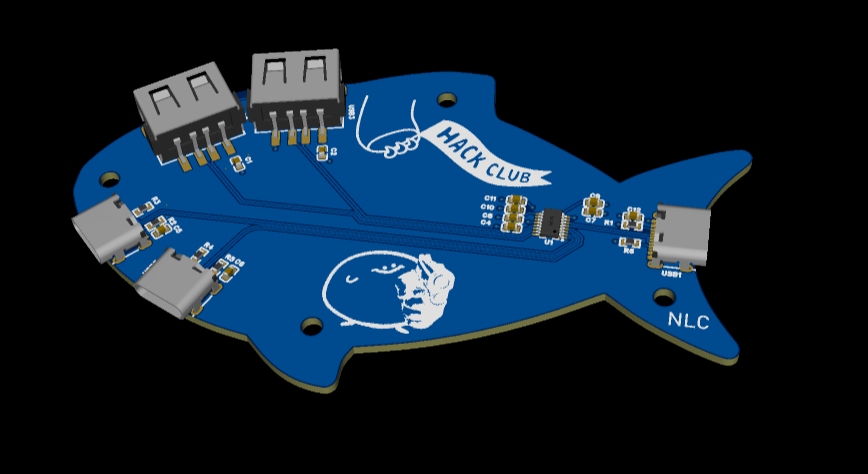
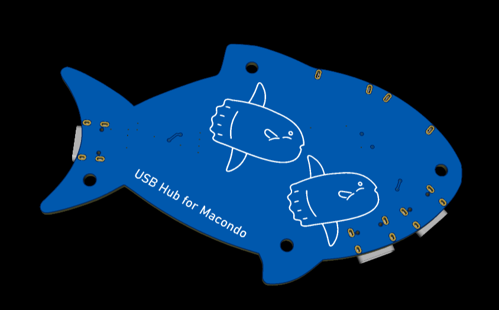

# Fishy-USB-Hub

A USB Hub containing 1 upstream USB-C port, and 4 downstream ports, 2 USB-C and 2 USB-A. I made the PCB in the shape of a fish, and added screw holes so I have the option for a case in the future. Designed with the help of Macondo Hack Club.

You can view my project with this link: https://u.easyeda.com/join?type=project&key=e26df47183f8c771f6b5de66a00006da&inviter=1b1839966aae4ba68db11111be6da725

*Features*

* 1x upstream USB-C port
* 2x downstream USB-A ports
* 2x downstream USB-C ports
* Fish-shaped PCB
* Mounting holes for optional casing in the future
